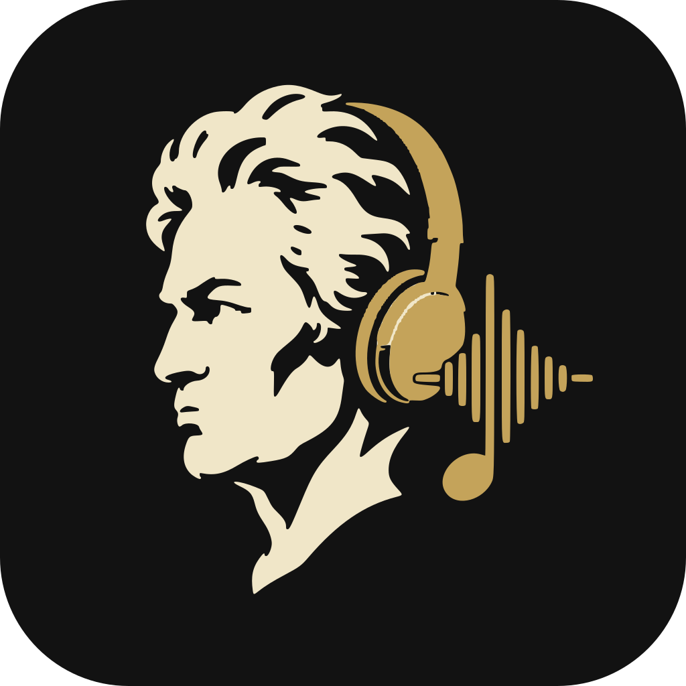

<p align="center">
  
</p>

# Beethovenly

A Discord music bot that joins voice, plays URLs with **mpv** (same idea as WagnerBot’s local player), falls back to **yt-dlp** when needed, and streams PCM to the voice channel. A button panel stays on the text channel for pause, skip, volume, loop, and queue.

**YouTube cookies are optional.** By default the bot plays like Wagner — `mpv` opens the URL with built-in ytdl, then anon yt-dlp clients. No Chromium login required for a normal `/play`.

## Quick start (Docker)

1. Create an application in the [Discord Developer Portal](https://discord.com/developers/applications).
2. Open the **Bot** tab → Reset Token → copy the token.
3. Message Content Intent is **not** required.
4. OAuth2 → URL Generator:
   - scopes: `bot`, `applications.commands`
   - permissions: View Channel, Send Messages, Embed Links, Read Message History, Connect, Speak
   - or use this invite link (replace `CLIENT_ID`):

```
https://discord.com/oauth2/authorize?client_id=CLIENT_ID&permissions=3230720&scope=bot%20applications.commands
```

5. Store secrets in GitHub (recommended):
   - Repo → **Settings** → **Secrets and variables** → **Actions** → **New repository secret**
   - Required: `DISCORD_TOKEN`
   - Optional: `COMMAND_GUILD_ID` (immediate slash-command sync on one guild)
6. Deploy with the included workflow (self-hosted runner with Docker), or run locally:

```bash
# Local fallback (do not commit .env)
cp .env.example .env
# set DISCORD_TOKEN=...
# optional: COMMAND_GUILD_ID=your_server_id

docker compose up -d --build
docker compose logs -f
```

On push to `main` (or via **Actions → Deploy → Run workflow**), GitHub Actions writes `.env` from those secrets and runs `docker compose up -d --build` on your self-hosted runner.

### Portainer

1. **Stacks** → **Add stack** → **Repository**: `https://github.com/M455YN/beethovenly.git`, compose path `docker-compose.yml`.
2. In **Environment variables**, add at least `DISCORD_TOKEN` (same names as `.env.example`).
3. Redeploy. Only the `beethovenly` service is required — Chromium/pot stay off unless you use profile `cookies`.
4. Compose uses `network_mode: host` on the bot (Linux) so Discord Voice UDP works.

Join a voice channel and run `/play never gonna give you up`. The control panel appears on the text channel.

## Features

- `/play` — URL or search (YouTube, SoundCloud, Bandcamp, plain audio URLs)
- Spotify links → finds a YouTube match (no Spotify API)
- playlists (capped by `PLAYLIST_LIMIT`) — YouTube/external URLs via `/play`, plus saved server playlists via `/playlist`
- `/playlist create|save|add|load|list|show|delete` — create and reuse named playlists (stored under `data/playlists/`)
- `/search` — clickable result list
- channel panel: ⏮️ pause ⏭️ stop 🔁 🔀 🔉 🔊 queue, plus a “jump to track” list
- loop modes: off / queue / one track
- leaves voice after idle silence (`IDLE_DISCONNECT_SECONDS`)

## Without Docker

You need Python 3.12+, `mpv`, `yt-dlp`, and `libopus`.

```bash
python3 -m venv .venv
source .venv/bin/activate
pip install -r requirements.txt
cp .env.example .env   # fill in the token
python -m bot
```

## Configuration

Use **GitHub Actions secrets** (same names) for deploy, or a local `.env` for manual runs.

| Variable / secret | Purpose |
|---|---|
| `DISCORD_TOKEN` | bot token (**required**) |
| `COMMAND_GUILD_ID` | sync slash commands to one guild (immediate) |
| `BOT_STATUS` | text shown in the “Listening to …” status |
| `IDLE_DISCONNECT_SECONDS` | leave voice after this many idle seconds (`0` = never) |
| `PLAYLIST_LIMIT` | max tracks from a playlist (1–200) |
| `COOKIES_FILE` | optional Netscape cookies (only if anon path fails) |
| `COOKIES_FROM_BROWSER` | optional; enables dump from Chromium profile |
| `COOKIES_REFRESH` | `1` = force cookie dump once |
| `YOUTUBE_POT_BASE_URL` | optional PO token HTTP service |
| `CHROMIUM_*` | only with `docker compose --profile cookies` |
| `SKIP_YTDLP_UPDATE` | `1` = do not update yt-dlp on container start |

### GitHub Secrets

1. Open [repository secrets](https://github.com/M455YN/beethovenly/settings/secrets/actions).
2. Add `DISCORD_TOKEN` (required) and optionally `COMMAND_GUILD_ID`.
3. Register a [self-hosted runner](https://docs.github.com/en/actions/hosting-your-own-runners/managing-self-hosted-runners/adding-self-hosted-runners) on the machine that should run Docker, then push to `main` or run **Deploy** manually.

### Optional YouTube cookies

Only needed if your host IP still gets *Sign in to confirm you’re not a bot* after the default mpv+ytdl / anon path. Follow the [yt-dlp robots.txt export](https://github.com/yt-dlp/yt-dlp/wiki/Extractors#exporting-youtube-cookies) flow:

1. `docker compose --profile cookies up -d`
2. VNC → `http://127.0.0.1:3000` → log into YouTube
3. Same tab → `https://www.youtube.com/robots.txt` (leave **only** that tab)
4. Set `COOKIES_FROM_BROWSER=chromium+basictext:/chrome-profile/.config/chromium`, `COOKIES_FILE=/app/data/cookies.txt`, `COOKIES_REFRESH=1`, restart `beethovenly`, then set `COOKIES_REFRESH=0`
5. Incomplete cookie dumps are **ignored** so they don’t make bot-check worse

## No audio?

Compose already sets `network_mode: host` on Linux so Discord Voice UDP works. Also confirm the bot has Speak / Connect and is not server-muted.

If the bot shows an offline panel and logs `WebSocket closed with 4006`, update voice deps:

```bash
.venv/bin/python -m pip install -U 'discord.py[voice]==2.7.1'
```

If tracks skip immediately, check logs for `mpv:` / `yt-dlp:` lines. On harsh datacenter IPs, try the optional cookies profile above.

## Commands

`/play` `/search` `/join` `/leave` `/skip` `/pause` `/stop` `/queue` `/nowplaying` `/volume` `/shuffle` `/loop` `/remove` `/clear` `/playlist` `/help`

Most controls are on the panel — slash commands are a fallback.

## How playback works

```
/play  →  yt-dlp (metadata only)
       →  mpv + ytdl  (Wagner-style: open URL directly → PCM)
       →  fallback: yt-dlp -o - | mpv -   (anon clients, then optional cookies)
       →  discord.py sends frames to Voice
```

`yt-dlp` is still updated on container start because extractors break often. Deno / EJS / pot-provider help the **fallback** cookie/web path; they are not required for the primary mpv+ytdl path.

## Tests

```bash
pip install -r requirements.txt
python -m pytest -q
```
